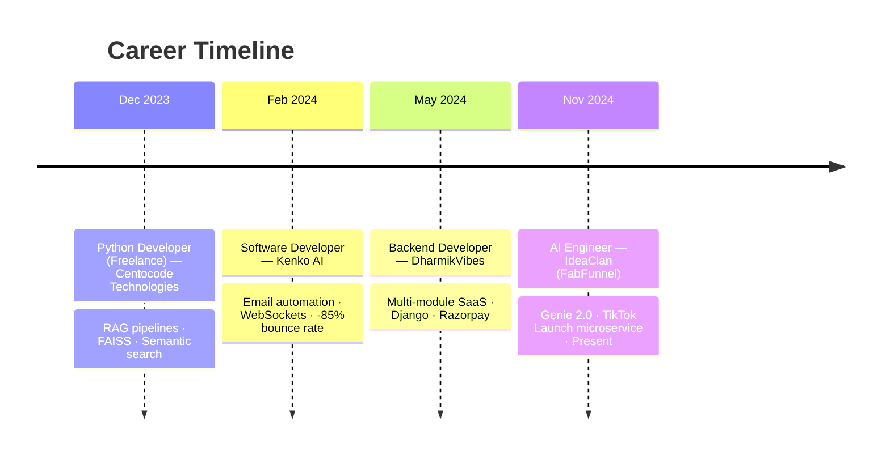

<div align="center">

<!-- Typing animation header -->


</div>

---

### 🧠 About Me

```python
class Sushil:
    def __init__(self):
        self.role = "AI Engineer & Python Backend Developer"
        self.based_in = "Chandigarh, India"
        self.experience = "2.5+ years"
        self.specialties = ["RAG Pipelines", "LLM Orchestration", "FastAPI/Django Backends"]
        self.currently_building = "AI-powered creative automation @ IdeaClan (FabFunnel)"

    def impact(self):
        return {
            "query_speed": "+70% faster",
            "bounce_rate": "-85%",
            "deployments": "+20% faster",
            "creative_turnaround": "-60%"
        }

    def fun_fact(self):
        return "I turn YouTube videos into scripts and movie characters into chatbots 🎬🤖"
```

---

### 🛠️ Tech Stack

<div align="center">

**Languages**
<br/>


**Frameworks & Backend**
<br/>


**AI / ML**
<br/>


**Databases & Caching**
<br/>


**DevOps & Cloud**
<br/>


**Integrations**
<br/>


</div>

---

### 💼 Professional Journey



<details>
<summary><b>🚀 AI Engineer @ IdeaClan (FabFunnel) — Nov 2024 – Present</b></summary>
<br/>

- Built **Genie 2.0**, a creative automation platform generating optimized ad creatives (images, UGC videos, storytelling ads) via automated AI workflows.
- Engineered the **TikTok Launch microservice**, integrating TikTok Marketing GraphQL APIs to automate campaign creation, ad launching, and asset management end-to-end.
- Built AI tools for the **Amalfa jewelry brand**, cutting creative turnaround time by **60%+**.
- Developed high-throughput backend services with Python, FastAPI, PostgreSQL, and microservice architecture.

</details>

<details>
<summary><b>🏗️ Backend Developer @ DharmikVibes — May 2024 – Oct 2024</b></summary>
<br/>

- Architected a multi-module SaaS platform (temple management, astrologer services, travel booking) using Django, PostgreSQL, and Docker.
- Integrated Astrology APIs for horoscope generation, kundli analysis, and AI-powered recommendations.
- Implemented Razorpay payments with full transaction lifecycle management.
- Improved API response times by **40%** through query optimization.

</details>

<details>
<summary><b>🔍 Python Developer (Freelance) @ Centocode Technologies — Dec 2023 – Apr 2024</b></summary>
<br/>

- Built semantic search services using OpenAI Embeddings and FAISS with adaptive chunking strategies.
- Developed RAG pipelines with FastAPI, reducing document retrieval latency by **35%**.
- Reduced deployment time by **20%** with Dockerized infrastructure, Traefik reverse proxy, and SSL termination.
- Implemented JWT and OAuth 2.0 for secure multi-tenant API access.

</details>

<details>
<summary><b>✉️ Software Developer @ Kenko AI — Feb 2024 – Nov 2024</b></summary>
<br/>

- Built email automation infrastructure with SendGrid and Celery — **99.9%** delivery reliability.
- Reduced email bounce rates by **85%** through automated validation of 30,000+ records.
- Improved database query performance by **70%** by eliminating N+1 bottlenecks.
- Developed a real-time messaging module using WebSockets and Django Signals.

</details>

---

### 🌟 Featured Projects

<table>
<tr>
<td width="50%" valign="top">

**🎬 ContentBridge**
*AI Content Repurposing Platform*

Converts YouTube videos into scripts, production guides, and content ideas using LLM-powered processing. Full Stripe subscriptions with usage-based rate limiting and Supabase-based auth.

`FastAPI` `PostgreSQL` `Supabase` `Stripe` `YouTube API` `OpenAI`

[🔗 View on GitHub](https://github.com/sushilsharma8)

</td>
<td width="50%" valign="top">

**🎭 Dialogue Genie**
*AI Movie Character Chatbot*

Chat with movie characters using RAG architecture and FAISS vector search for context-aware responses. Redis caching cut response latency by 40%, with Prometheus + Grafana observability.

`FastAPI` `RAG` `FAISS` `GPT-4` `Gemini` `Redis` `Grafana`

[🔗 View on GitHub](https://github.com/sushilsharma8)

</td>
</tr>
</table>

---

### 🎓 Education

**Bachelor of Engineering – Artificial Intelligence & Machine Learning**
BMS Institute of Technology and Management, Bengaluru · *Jun 2024*

---

### 📊 GitHub Stats

<div align="center">


</div>

---

### 🔭 Currently Exploring

- 🧩 Multi-agent AI workflows and advanced LLM orchestration
- 🖼️ Image/video generation model integrations for creative automation
- ⚙️ Scaling RAG pipelines for production-grade throughput

---

### 📫 Let's Connect

<div align="center">

<a href="https://www.linkedin.com/in/itzsushilsharma/"></a>
<a href="https://github.com/sushilsharma8"></a>
<a href="mailto:sushilsharma8oct2001@gmail.com"></a>

</div>

---

<div align="center">

*💡 When I'm not shipping AI pipelines, I'm probably exploring new tech, deep in a video game, or reading about the next big thing in AI.*

</div>
